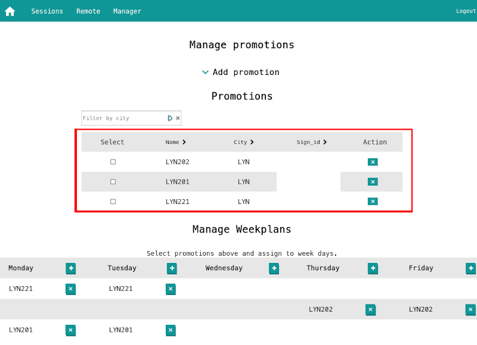
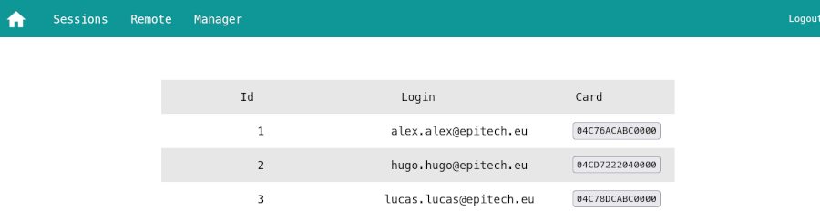

# Card Tag
Python script used to link a student email with an NFC card.

## Table of Contents

- [Prerequirement](#prerequirement)
- [Run](#run)
- [License](#license)

## Prerequirement
- `hatch` is the [project manager](https://github.com/pypa/hatch) used for the Card-Tag project.

You may need to run `sudo modprobe -rf pn533_usb` before to free the nfc reader.


## Run
It is advised to remove any old linked cards from a student before linking a new one. To do this, go to [Console Bocal](https://console.bocal.org/#/cards), use the "Get User Cards" route, and unlink every card that shows up.


Once done, run the following command:

```bash
hatch run ./nfc-sync.py -r usb:072f:2200
```

Log in with an account that has access to the cards route in Console Bocal.

Then, scan any card you want and associate it with an email.

Once linked, you must update the card ID in Clikodrome. Go to Manager and click on a promotion:



Then edit the card IDs accordingly.




## License

`card-tag` is distributed under the terms of the [MIT](https://spdx.org/licenses/MIT.html) license.
